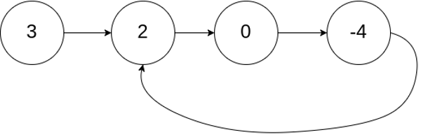
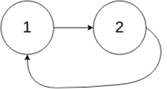
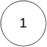

# HW3 EE599 - Computing Principles for Electrical Engineers

- Plesae clone the repository, edit [README.md](README.md) to answer the questions, and fill up functions to finish the hw.
- For non-coding quesitions, you will find **Answer** below each question. Please write your answer there.
- For coding questions, please make sure that your code can run ```bazel run/test```. In this homework, you will need to fill up [cpplib.cc](src/lib/cpplib.cc) and tests in [tests](tests).
- For submission, please push your answers to Github before the deadline.
- Deadline: Monday, September 28st by 23:59 pm
- Total: 130 points. 100 points is considered full credit.

## Question 1 (10 Points. Easy)

Please compare pros and cons of the following options:

- Passing parameters by value
- Passing parameters using pointers
- Passing parameters using references
- Passing parameters using const references

Please mention when each item is preferred.

Answer:

## Question 2 (20 Points. Easy)

Given a vector of integer *input*, and an integer *sum*, return a set of sets {a,b}, where a,b are in the input vector and a+b = sum, which are the numbers in *input* such that they can add up to sum. Function is defined as ```std::set<std::set<int>> twoSum(std::vector<int>& input, int sum)```

- you can assume the vector input doesn't contain duplicated numbers.
- you can only use numbers in vector once.
- if there is no answer, the output should return an empty set.
- you should return **all** results in the input vector if there are multiple answers.
- **Hint**: you may try unordered_map.
- Examples:

  - input = {2,3,4,5}, sum = 7, output = {{2,5},{3,4}}
  - input = {2,3,-2,5,0}, sum = 0, output = {{2,-2}}
  - input = {1,5,4,10}, sum = 200, output = {}

Write several tests using GTest for your function in [tests/q2_student_test.cc](tests/q2_student_test.cc).
Please create your test cases and run the following command to verify the functionality of your program.And what's your function's **time complexity**?
```
bazel test tests:q2_student_test
```
Please compute the time complexity of your implementation.

Answer:

## Question 3 (50 Points. Medium)

Implement the following class for a Linked List of integer values in your [cpplib.cc](src/lib/cpplib.cc) file.

```c++
struct ListNode {
    int val;
    ListNode *next;
    ListNode(int x) : val(x), next(nullptr) { }
};

class SinglyLinkedList {
public:
  // default constructor
  SinglyLinkedList();

  //constructor creates a cyclic or acyclic linked list based on the value of i
  //if i is negative or greater than input size, the last item's next is nullptr
  //else creates a linked list out of vector "input" and connects the last item's next to i(th) item in the list
  SinglyLinkedList(vector<int> &input, int i);
  
  ~SinglyLinkedList(); //destructor, cleans up

  bool empty();//checks if empty

  int size(); //returns size

  void push_back(int i);//inserts at the back

  void push_front(int i);//inserts at the front

  void insert_after(ListNode* p, int i);//inserts value i after p

  void erase(ListNode* p);//erases node p

  void pop_front();//remove the first item

  void pop_back();//remove the last item

  ListNode* GetBackPointer();//returns the pointer to the last item

  ListNode* GetIthPointer(int i);//returns pointer to ith element

  void reverse(); // reverse the linked list in-place

  void print();//prints the list: ex. Empty list: { }. List with Items: {1, 2, 3}

  ListNode *head_;//Pointer to the first element

};
```

You can assume that the Linked List is **acyclic** except for the constructor ```SinglyLinkedList(vector<int> &input, int i);```.

All functions except for print()/constructor/destructor require a GTest.

Write several tests using GTest for your function in [tests/q3_student_test.cc](tests/q3_student_test.cc).

Please create your test cases and run the following command to verify the functionality of your program.

```c++
bazel test tests:q3_student_test
```
Please compute the time complexity of your implementation.

Answer:

## Question 4 (10 Points. Easy)

Write 2 classes to practice how to use the constructor, copy constructor, copy assign operator and destructor and compare the deep copy with shallow copy.

Both of the Student_shallow and Student_deep has one member integer pointer id.

- Student_shallow
  - Write a **default constructor** to allocate and initialize id to 0
  - Write a **parameterized constructor** to initialize id

- Student_deep
  - Write a **default constructor** to allocate and initialize id to 0
  - Write a **parameterized constructor** to initialize id
  - Write a **destructor** to print "Delete Student_deep!" and delete the integer pointer
  - Write a **copy constructor** with **deep copy**
  - Write a **copy assignment operator** with **deep copy**

```c++
class Student_shallow
{
public:
    int* id;
    Student_shallow();
    Student_shallow(int);
};
class Student_deep
{
public:
    int* id;
    Student_deep();
    Student_deep(int);
    ~Student_deep();
    Student_deep(const Student_deep&);
    Student_deep& operator=(const Student_deep&);
};
```

Eaxmple:
```
Student_shallow a;
Student_shallow b = a;
Student_shallow c;
c = a;
cout << *a.id << *b.id << *c.id << endl;
*c.id = 1;
cout << *a.id << *b.id << *c.id << endl;

Student_deep a;
Student_deep b = a;
Student_deep c;
c = a;
cout << *a.id << *b.id << *c.id << endl;
*c.id = 1;
cout << *a.id << *b.id << *c.id << endl;
```
Exepcted output:
```
000
111
000
001
Delete Student_deep!
Delete Student_deep!
Delete Student_deep!
```

Write several tests using GTest for your function in [tests/q4student_test.cc](tests/q4_student_test.cc).

Please create your test cases and run the following command to verify the functionality of your program. You don't need to test the destructor.
```
bazel test tests:q4_student_test
```

## Question 5 (20 Points. Medium)
Write a class to implement how complex number works in mathematics. A complex number can be expressed 
as **a+bi**, where a and b are real numbers. You are given an incomplete class `Complex`:
```c++
class Complex{
 public:

  Complex():real(0), ima(0){};
  ~Complex();
  float real;
  float ima;
```
Tasks:
1. implement a constructor that takes the initial real and imaginary number as 2 parameters.
2. implement a copy constructor.
3. implement a copy assignment operator.
4. the class will support '++' (as postfix) and '--' (as prefix) operators.
  - `complex++` should increase the real part by 1. 
  - `--complex` should decrease the real part by 1.
    - Example: `c=Complex(1,2); c++;`, *c=2+2i*
    - Example: `c=Complex(1,2); --c;`, *c=0+2i*
5. the class will support '>' operator, which return a boolean data:
  - if both real and imaginary part of left hand side is larger than the right hand side, the answer will be true, otherwise, the answer is false.
    - Example: (1+2i) > (0+3i) = *false*
6. the class will support '*' operator, which multiplies a real number:
  - the function returns a Complex object, which is multiplied both the real and imaginary parts.
    - Example: `c=Complex(1,2); d=Complex(); d=c*2;`, *d=2+4i*
7. the class will support '+=' operator on either float number and Complex object:
  - data type before '+=' must be a Complex object.
    - Example: `c=Complex(1,2); d=Complex(3,4); c+=d;`, *c=4+6i*
    - Example: `c=Complex(1,2); float d=2; c+=d;`, *c=3+2i*


Write a test using GTest for your finction in [tests/q5_student_test.cc](tests/q5_student_test.cc).
```
bazel test tests:q5_student_test
```

## Question 6 (20 Points. Medium)
Given an expression string, find if the input has valid brackets (i.e. { } or [ ] or ( ) ). Function is defined as ```bool​ ​CheckValidExpression​(​const​ ​string​&​ ​a​)```

An input expression is valid if:

Open brackets are closed by the same type of brackets.
Open brackets must be closed in the correct order.
An empty string is also considered valid.

You should only check for the validity of brackets based on the above rules, i.e. ‘(‘, ‘)’, ‘[‘, ‘]’, ‘{‘, ‘}’, not the rest of the expression.

👉Hint: Iterate the input from beginning to end and use a std:stack.

Example 1:
Input: "(a+b)"
Output: true

Example 2:
Input: "(a+b)[c*d]{5g+h}"
Output: true

Example 3:
Input: "(a+b]"
Output: false

Example 4:
Input: "(7h+[5c)+7]"
Output: false

Example 5:
Input: "{2k+[5j]}"
Output: true

Example 6:
Input: "{2k++[5--*j]}"
Output: true

Write a test using GTest for your finction in [tests/q6_student_test.cc](tests/q6_student_test.cc).
```
bazel test tests:q6_student_test
```
Please compute the time complexity of your implementation.

Answer:
## Optional Question

The goal of this section is to introduce you to more challenging questions and some common problems in coding and algorithms.

- These questions don’t have any credits.
- We may not provide complete solutions or grading for them.
- Solving them is completely optional.

## Optional Question 1 (Easy)

- Write a function that prints all items in a std::stack. After the print, the items in the stack should remain the same.
- Write a function that prints all items in a std::queue. After the print, the items in the queue should remain the same.

## Optional Question 2 (Medium)

For the SinglyLinkedList class that you designed earlier, Implement this function:

```c++
bool DetectCycle();
```

This returns a true if it detects the linked list has a cycle. The cycle happens when the last item’s is pointing to a node inside the list rather than nullptr.

To create linked lists with cycles, use this constructor with i > 0 as described in SinglyLinkedList class above:

```c++
SinglyLinkedList(const std::vector<int> &inputs, int i)
```

Example 1:\
Input: inputs = [3,2,0,-4], i = 1\
Output: true\
Explanation: There is a cycle in the linked list, where tail connects to the second node.



Example 2:\
Input: inputs = [1,2], i = 0\
Output: true\
Explanation: There is a cycle in the linked list, where tail connects to the first node.



Example 3:\
Input: inputs = [1], i = -1\
Output: false\
Explanation: There is no cycle in the linked list.



## Optional Question 3 (Medium)

For the SinglyLinkedList class, Implement the following function:
```
void erase(ListNode* p);
```
Where p is a pointer to a node that we want to erase. Your implementation should be O(1).

## Optional Question 4 (Medium)

Add two more variables to the SinglyLinkedList class:
- size_: which tracks the size of the list.
- tail_: which always points to the last item in the list if the list doesn’t have a cycle, otherwise, its value is nullptr.

How do each of these change the runtime of the class methods?

## Optional Question 5 (Medium)

Convert the SinglyLinkedList class to DoublyLinkedList class, where each node points to both its next and previous nodes. How would this change the runtime of the class methods?

## Optional Question 6 (Medium)

Write a program that takes a vector as a parameter, prints it, and then depending upon the user input, it performs various operations on a vector using an iterator and iterator functions.

- Your code should have a variable to track the current location which will be pointing at the first element of the vector as soon as you start execution of your code and changes as the program runs.
- You should print a menu to the user to perform the following operations.

Example input vector: [10, 20, 30, 40, 50, 60, 70, 80, 90, 100]

Menu:

1. What is the first element?

Once this is selected, the first element should be printed and the current location should be set to the first element.

2. What is the last element?

Once this is selected, the last element should be printed and the current location should be set to the last element.

3. What is the current element?

This should print the value at the current location. See examples below.

4. What is the i(th) element from the current location?

Once this is selected, the code should print the value at the current location.

If the value of i is negative then you should prompt an appropriate message to the user and should prompt the menu options again. (Eg: “Value of i cannot be negative”)

If the value of i is greater than the size of your vector then you should prompt an appropriate message to the user and should prompt the menu options again. (Eg: “Value of i cannot be greater than the size of vector”)
5. Exit.

- Your code should do this until the user enters “5”, which is “Exit”. When the user selects 5 you should print “Exit!” and end the execution.
- GTests are NOT required for this question.
- Submit your code, along with a sample text file of the output for this input vector:
  - [1, 4, 5, 23, 100, 12, 18, 175]
  - Assume the user selections from the menu are: 1, 2, 3, 1, 3, (4,2), 5

```c++
********************************************************************* *
Vector: 10, 20, 30, 40, 50, 60, 70, 80, 90, 100
********************************************************************* *
Please choose any of the following options:
1. What is the first element?
2. What is the last element?
3. What is the current element?
4. What is the ith element from the current location?
5. Exit. *********************************************************************
*
1
Output: 10
********************************************************************* *
Vector: 10, 20, 30, 40, 50, 60, 70, 80, 90, 100
********************************************************************* *
Please choose any of the following options:
1. What is the first element?
2. What is the last element?
3. What is the current element?
4. What is the ith element from the current location?
5. Exit. *********************************************************************
*
4
Enter the value of i:: 3
Output: 40
********************************************************************* *
Vector: 10, 20, 30, 40, 50, 60, 70, 80, 90, 100
********************************************************************* *
Please choose any of the following options: 
1. What is the first element?
2. What is the last element?
3. What is the current element?
4. What is the ith element from the current location?
5. Exit. *********************************************************************
*
3
Output: 40
********************************************************************* *
Vector: 10, 20, 30, 40, 50, 60, 70, 80, 90, 100
********************************************************************* *
Please choose any of the following options:
1. What is the first element?
2. What is the last element?
3. What is the current element?
4. What is the ith element from the current location?
5. Exit. *********************************************************************
*
2
Output: 100
********************************************************************* *
Vector: 10, 20, 30, 40, 50, 60, 70, 80, 90, 100
********************************************************************* *
Please choose any of the following options:
1. What is the first element?
2. What is the last element?
3. What is the current element?
4. What is the ith element from the current location?
5. Exit. *********************************************************************
*
4
Enter the value of i::
3
Output: Sorry! You cannot traverse 3 elements from your current location.
********************************************************************* *
Vector: 10, 20, 30, 40, 50, 60, 70, 80, 90, 100
********************************************************************* *
Please choose any of the following options: 
1. What is the first element?
2. What is the last element?
3. What is the current element?
4. What is the ith element from the current location?
5. Exit. *********************************************************************
*
3
Output: 100
********************************************************************* *
Vector: 10, 20, 30, 40, 50, 60, 70, 80, 90, 100
********************************************************************* *
Please choose any of the following options:
1. What is the first element?
2. What is the last element?
3. What is the current element?
4. What is the ith element from the current location?
5. Exit. *********************************************************************
*
1
Output: 10
********************************************************************* *
Vector: 10, 20, 30, 40, 50, 60, 70, 80, 90, 100
********************************************************************* *
Please choose any of the following options: 
1. What is the first element?
2. What is the last element?
3. What is the current element?
4. What is the ith element from the current location?
5. Exit. *********************************************************************
*
3
Output: 10
********************************************************************* *
Vector: 10, 20, 30, 40, 50, 60, 70, 80, 90, 100

********************************************************************* *
Please choose any of the following options: 
1. What is the first element?
2. What is the last element?
3. What is the current element?
4. What is the ith element from the current location?
5. Exit. *********************************************************************
*
4
Enter the value of i:: 3
Output: 40
********************************************************************* *
Vector: 10, 20, 30, 40, 50, 60, 70, 80, 90, 100
********************************************************************* *
Please choose any of the following options: 
1. What is the first element?
2. What is the last element?
3. What is the current element?
4. What is the ith element from the current location?
5. Exit. *********************************************************************
*
5
Exit !
```
